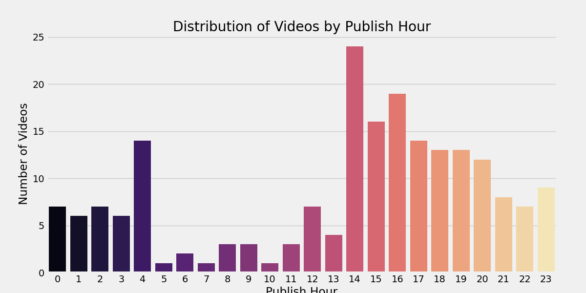
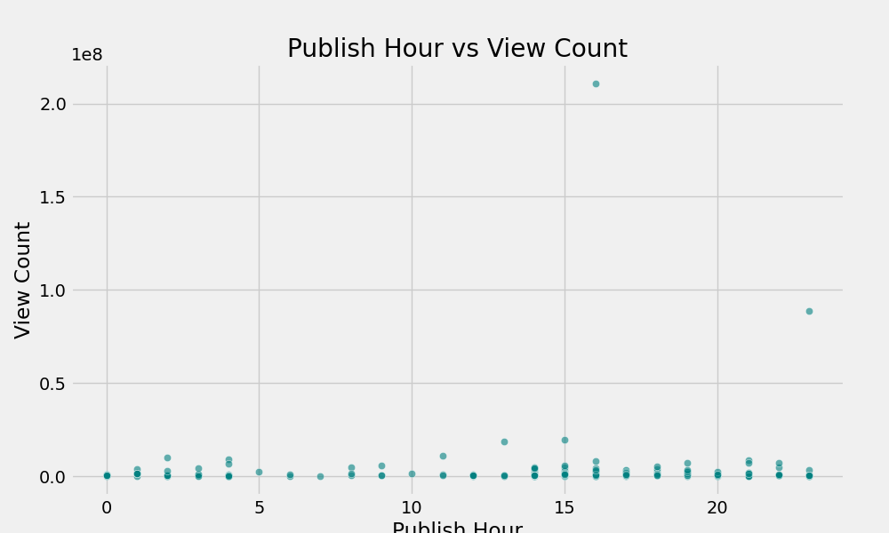
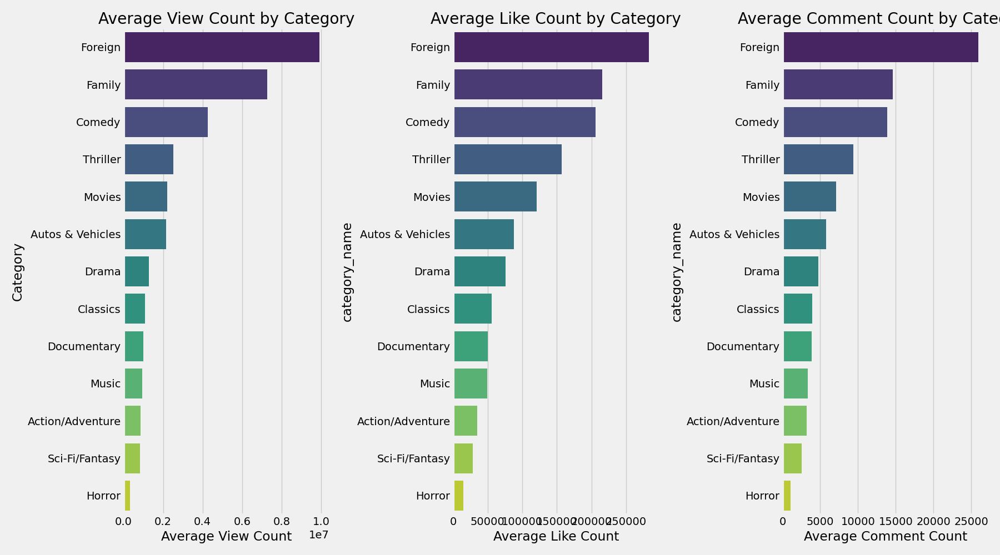
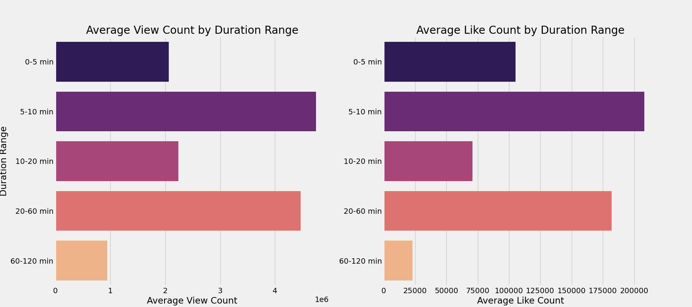
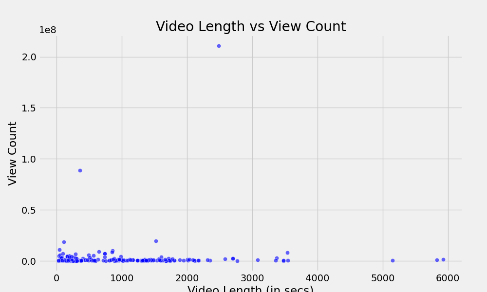
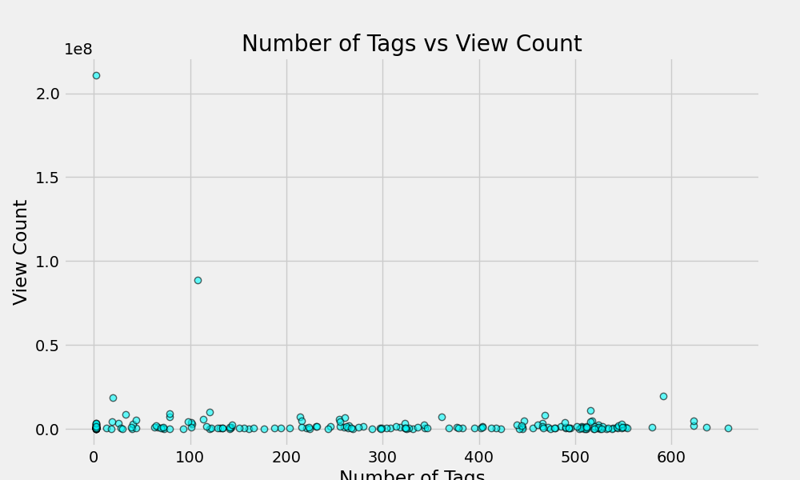

# YouTube-Trending-Videos-Data-Analysis
The Project is based on Analyzing various relations and properties of the dataset. The dataset is based on Trending YouTube Videos of July-August 2024.
Providing Insights about How to make video Trend.

## Business Understanding
### The objective of this data science project is:
<ul>
  <li>To Import Data of Trending YouTube Videos using Google Cloud Console</li>
  <li>To Store and Analyze Various Relations Between The Variables </li>
  <li>Provide Insights about the Optimal Posting of YouTube Videos with an Expectation of Higher Interactions</li>
</ul>

 

## Data Understanding
 The datasets is obtained using Google Cloud Console by generating an API Key. The dataset contains information about Top 200 Trending YouTube Videos, which includes Title, Description, Channel Name, Duration, Published Date and Time, View count, Like count, Comment count.

 

## Analysis
### 1. Highly viewed and liked Video
<li>"50 YouTubers Fight For $1,000,000"</li>
 - Video By Mr.Beast 
 - View Counts = 2,10,701,320 (2.1 Billion) 
 - Like Counnts = 8,207,977 (8.2 Million) 
 
 It maybe due to engagement of audiences of multiple YouTubers.

### 2. Classifying Trending Videos Category-wise

<ul>
  <li>The bar chart shows that the Entertainment, Gaming, Music and Sports Categories has the highest number of Trending Videos</li>
</ul>

 

### 3. Relation between Publish Hours and Number of Videos Posted

<ul>
	<li>The distribution shows that most of the trending videos is posted between 15:00 to 21:00, which may indicate it as an optimal posting time range.</li>
</ul> 
 

### 4. Average Like count, View count and Comment count of each category

<ul>
	<li>The Horizontal Bar Chart represents News & Politics, Entertainment aand Music Category has the highest average views, likes and comments.</li>
</ul> 
 

### 5. Effect of Video Length on Views and Likes count

 

<ul>
	<li>The scatter plot shows slight negative correlation between video length and view count.</li>
	<li>Videos length in the range of 5-10 mins and 20-60 mins, tends to have higher number of interaction with audience, in terms of views and like count.</li>
</ul> 
 

### 6. Effect of Tags on View Count

<ul>
	<li>The scatter plot shows negative correlation between number of tags and view count.</li>
	<li>It represents that number of tags attached with the video shows a minimal effect on the view count.</li>
</ul> 
 

## Conclusion

### Therefore, My conclusion on how to make video trend nowadays,
#### <b>1. Try to make entertaining videos or musical content.</b>
#### <b>2. Encourage your audience to like and comment on your videos.</b>
#### <b>3. Aim to post your video within 3pm to 9pm for maximizing initial view counts.</b>
#### <b>4. Try to keep video lengths between 5-10 mins or 20-60 mins.</b>
 

## Author
### Tushar Mukherjee 

<a href="mailto: mukherjeetushar78@gmail.com">E-mail</a> || <a href="https://www.linkedin.com/in/tushar-mukherjee-b8516028a">LinkedIn</a> || <a href="https://github.com/GocoVoid">GitHub</a>
